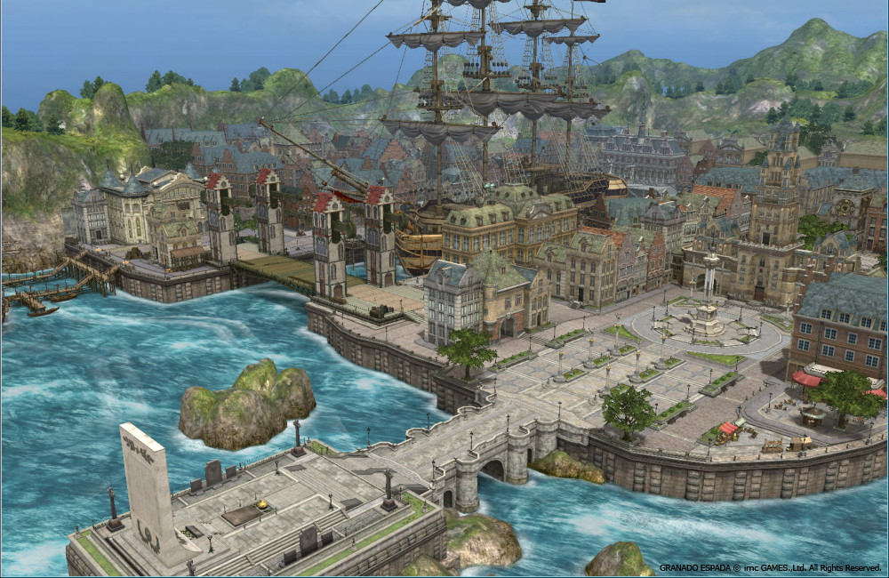
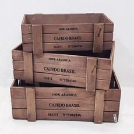
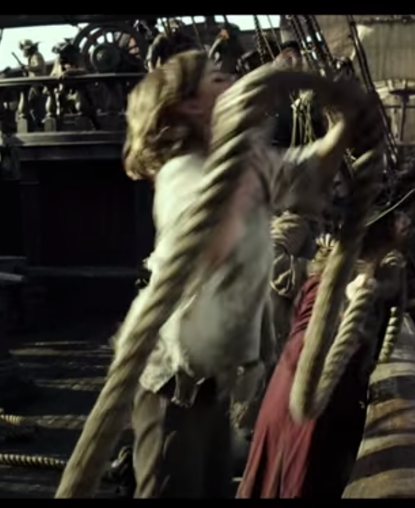
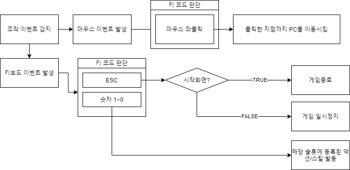
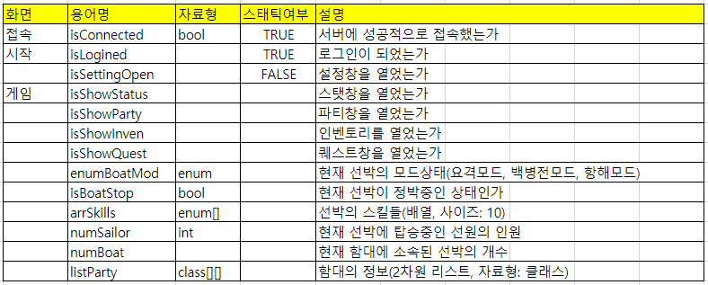

# Age Of Voyage

## 0. 목차
#### 1) [컨셉](#1)
#### 2) [관련 이미지와 동영상](#2)
#### 3) [대표이미지 그리고 컨셉과 대표이미지 기반 작품 묘사](#3)
#### 4) [Age Of Voyage 구성요소](#4)
#### 5) [게임 시스템 디자인](#5)
#### 6) [요구사항](#6)
#### 7) [키보드 이벤트에 대한 흐름도](#7)
#### 8) [용어 정리](#8)
#### 9) [주별 개발작업 계획표](#9)
#### 10) [주별 작업결과 목록](Results/index.md)
    
## 1. 컨셉
#### 1) 메인 컨셉 :: 대항해시대
- 15~18세기중반까지 이루어졌던 항로를 개척하고 탐험과 무역을 하던 시기.
- 대항해시대를 메인컨셉으로 잡아 게임을 제작을 할 것.

#### 2) 서브컨셉1 :: 모험
- 대항해시대의 특성상 항로를 개척하기위해 바다와 여러 대륙들과 섬들을 탐험했었음.
- 그렇기에 이 게임에서도 바다, 대륙 그리고 섬을 탐험하고 모험하는 기능을 추가할 것.

#### 3) 서브컨셉2 :: 거래
- 또한 대항해시대때는 **무역** 또한 많이 진행됬었음.
- 그것을 토대로, 플레이어가 무역을 하고 AI도 무역을 하며 거래를 할때마다 **시세차익**도 발생하게 할 것.

#### 4) 서브컨셉3 :: 위험
- 대항해시대는 그야말로 **기회의 시대**였음. 허나, 반대로 언제든지 죽음이 뒤따르는 위험한 시대이기도 했었음.
- 탐험의 위험, 항해의 위험 등을 넣어 플레이어가 게임을 긴장하며 플레이할 수 있도록 여러 위험요소를 추가.
- 해적, 폭풍, 섬의 원주민들 등등..

#### 5) 서브컨셉4 :: 해적
- 대항해시대가 기회의 시대인 만큼 그 기회를 노리려 떠나는 여러 모험가들과 상인들을 습격하는 **해적**들도 많았음.
- 플레이어는 그 해적의 입장이 되어 싸워볼 수도 있음.

#### 6) 서브컨셉5 :: 국가
- 대항해시대에는 상인, 모험가들만이 기회를 찾는것이 아님. 여러 제국, 왕국들도 그 기회에 홀려 이 시대에 참가하기도 했음.
- **세력전**과 비슷한 양상을 만들어 어느 국가에 고용되어 국가 소속 모험가, 사략선으로 플레이할 수도 있음.

## 2. 관련 이미지와 동영상

#### 1) 관련 이미지
- 
- 
- 

#### 2) 관련 동영상
-  

## 3. 대표 이미지 그리고 컨셉과 대표이미지 기반 작품 묘사
#### 1) 접속 화면
- 

#### 2) 시작 화면
- 

#### 3) 게임 화면
- 

## 4. Age Of Voyage 구성요소

#### 1) 메커니즘
- 미지의 대륙과 여러 섬을 탐험하여 보물을 발견하거나, 미지의 대륙에 있는 거대한 제국과 거래를 하거나 약탈을 하여 엄청난 부를 챙겨보자.
- 또한, 그런 기회를 찾는 여러 모험가와 상인들의 선박을 공격하고 약탈하여 부를 챙기는 해적도 되어보자.
- 그리고 항로를 개척하여 또 다른 세계의 여러 왕국, 제국들과 무역을 하여 엄청난 부를 챙기거나, 명성을 챙겨보자.
- 이런 위험천만하고 도박과도 같은 **대양 무역과 탐험**에 투자하여 이익을 챙길 수 있는 주식도 해보자.

#### 2) 이야기
- 새로운 시대가 도래했다. 세상은 우리만 있는게 아니었으며, 평평한 세상이 아닌 둥근 세상이었다! 저 멀리에 있는 아무도 만나보지 못한 미지의 제국들과 거래를 하거나 미지의 고대 제국이 남긴 보물을 챙겨 엄청난 부에 앉아보자. 엄청난 기회를 챙겨 부자가 될 수 있는 **대항해시대**가 도래했다!

#### 3) 미적요소
- 대항해시대 15~17세기 유럽 풍의 느낌으로 디자인.
- 쉐이더를 이용하여 뛰어난 다중 플랫폼 지향적인 그래픽을 구사.

#### 4) 기술
- 유니티의 URP(Universal Render pipeline), Terrain Tools, PolyBrush, ProBuilder를 이용하여 매우 세부적인 그래픽을 구사.
- Blender, Texture Heaven(사이트)을 이용하여 지형 텍스쳐링, 선박 모델링, 도시 모델링 등을 구사.
- socket.io를 이용하여 서버-클라이언트 방식의 온라인 게임을 제작.

## 5. 게임 시스템 디자인

#### 1) 게임 오브젝트 분해

|번호|명칭|이미지|
|---|---|---|
|1|선박||
|2|항구||
|3|탐험지역||
|4|무역아이템||
|5|선원||
|6|항해사||
|7|선장||

#### 2) 파라미터 :: 선박
- 선박명(name): 선박의 명칭. XX호 이런식으로. 예를들어, 블랙 펄 호. 플라잉 더치맨 호. 말 그대로, 선박의 이름을 뜻한다.
- 선박타입(enumTypeBoat): 현재 선박의 타입. **항해 특화( *속력, 선회력* )**, **전투 특화( *장갑, 포문개수* )**, **무역 특화( *속력, 최대 하중* )**
- 속력(speed): 선박의 속도.
- 선회력(rotateSpeed): 선박의 선회력.
- 내구도(durability): 선박의 내구도.
- 장갑(armor): 선박의 방어력.
- 포문개수(numCannon): 선박 포문 개수.
- 화물칸(cargos): 선박의 화물칸들.
- 하중(weight): 선박이 탑재 가능한 최대 하중.
- 선실개수(numRoom): 선박의 선실 개수.
- 선장(captain): 현재 선박의 선장.
- 선원들(listSailor): 현재 선박에 탑승한 선원들.
- 최소요구선원인원(numNeedSailor): 선박을 운용하기위해 필요한 최소 선원 인원.
- 선박모드(enumModeBoat): 현재 선박의 모드상태. 요격모드, 백병전모드, 항해모드.

#### 3) 파라미터 :: 항구
- 항구이름(name): 항구의 이름.
- 소속국가(force): 항구가 소속된 국가 또는 세력.
- 특산물(listBestItem): 항구의 특산물
- 부흥도(howRich): 항구의 부흥도.
- 정박중인 함선들(listParkingBoats): 현재 이 항구에 정박중인 함선들.

#### 4) 파라미터 :: 탐험지역
- 탐험지역명칭(name): 탐험지역의 명칭. 고대 제국의 폐허, 파묻힌 보물의 섬 등등..
- 난이도(difficulty): 해당지역 탐험 난이도.
- 항구이름(name): 항구의 이름.
- 소속국가(force): 항구가 소속된 국가 또는 세력.
- 특산물(listBestItem): 항구의 특산물
- 부흥도(howRich): 항구의 부흥도.
- 정박중인 함선들(listParkingBoats): 현재 이 항구에 정박중인 함선들.

#### 5) 파라미터 :: 무역 아이템
- 아이템 이름(name): 아이템의 명칭.
- 아이템의 종류(enumTypeItem): 아이템의 종류. 음식, 향신료, 무기, 재료 등등..
- 구입당시 시세(quoteBuy): 아이템을 구입했을때에 당시 시세.
- 무게(weight): 아이템의 무게

#### 6) 파라미터 :: 선원
- 이름(name): 선원의 이름.
- 전투력(battlePower): 선원의 전투력.
- 해적인가(isPirate): 해당 선원은 해적인가.

#### 7) 파라미터 :: 항해사
- 이름(name): 항해사의 이름.
- 전투력(battlePower): 항해사의 전투력.
- 해적인가(isPirate): 해당 항해사는 해적인가.
- 항해실력(driving): 항해사의 항해 실력.

#### 8) 파라미터 :: 선장
- 이름(name): 선장의 이름.
- 전투력(battlePower): 선장의 전투력.
- 해적인가(isPirate): 해당 선장은 해적인가.
- 항해실력(driving): 선장의 항해 실력.
- 판단력(judge): 선장의 판단력.
- 화술(speech): 선장의 화술.
- 해전숙련도(seaBattleExp): 선장의 해전 숙련도. 높을수록 해전을 잘한다.

#### 9) 상태 :: 선박

|행동명|설명|
|---|---|
|정박중|항구 또는 탐험지역에 선박을 정박중.|
|항해중|항해모드.|
|요격중|대포로 요격중. 요격모드.|
|백병전중|백병전 하는 중. 백병전모드.|
|탐험중|탐험지역 탐험중.|
|거래중|항구에서 거래중.|
|정비중|함선이 현재 정비중 **(수리를 한다거나 등등)** |

#### 10) 플레이어 속성
- 이름(name): 플레이어의 이름.
- 전투력(battlePower): 플레이어의 전투력.
- 해적인가(isPirate): 해당 플레이어는 해적인가.
- 항해실력(driving): 플레이어의 항해 실력.
- 판단력(judge): 플레이어의 판단력.
- 화술(speech): 플레이어의 화술.
- 해전숙련도(seaBattleExp): 플레이어의 해전 숙련도. 높을수록 해전을 잘한다.
- 탑승중인선박(nowRidingBoat): 현재 탑승중인 선박.
- 현재수락한퀘스트목록(listQuest): 현재 플레이어가 수락한 퀘스트 목록.

#### 11) 게임의 규칙
- 플레이어가 전투 중 사망하면 적군의 포로로 잡힘. 이후 포로 상태에서 탈출하면 뗏목으로 시작한다.
- 반대로 NPC는 전투 중 사망하면 영원히 사망한다. 만약 NPC가 전투력이 높다면 사망하지 않고 부상만 입은체로 생존할 확률이 높아진다.
- 해당 지역의 시세가 대량 구매, 판매 등의 이유로 변했을때에, 시간이 지나면 시세 기본값으로 자연 회복된다.

## 6. 요구사항

#### 1) 접속화면
- socket.io 서버로 접속을 시도합니다. 접속실패시 **접속실패 메시지**를 생성합니다.
- 반대로, 접속성공시 시작화면으로 이동합니다.
- 화면 중앙에는 로딩 GIF 이미지가 배치되며, 재생되고 있습니다.

#### 2) 시작화면
- 배경은 바다에 여러 선박들이 돌아다니는 장면, 선박이 항구에 정박을 하는 장면 등 여러 장면들이 Fadein과 Fadeout을 반복하며 차례 차례 보입니다. 장면들은 약간 흐릿하게 보입니다.
- 그 앞에 크고 화려한 글꼴과 스타일로 **대항해시대**라 적힌 텍스트가 화면 상단 중앙에 배치되어 있습니다.
- 또한 화면 중앙에는 **로그인**이라 적힌 버튼이 배치되어 있습니다. 이 버튼을 누를시, **로그인메시지**가 생성됩니다.
- 마지막으로 화면 우측 상단에는 톱니바퀴 그림 아이콘이 그려져 있는 **설정** 버튼이 있습니다. 이 버튼을 누를시, **설정메시지**가 생성됩니다.
- **ESC**를 누르면 **게임이 종료** 됩니다.

#### 3) 월드뷰 화면
- 세계맵이 보이며, 그 세계맵을 돌아다니는 NPC/PC 파티가 보입니다.
- 화면 하단에는 **캐릭터 스탯 / 함대 정보 / 화물칸 / 퀘스트** 버튼이 가로 정렬되어 보입니다.
- 또한 화면 좌측 상단에는 일시정지 버튼이 보입니다.
- 마우스 좌클릭을 하면 클릭한 부분으로 캐릭터 파티가 이동합니다.
- 키보드 1~0키(상단)을 눌러 요격모드, 백병전모드, 항해모드로 전환할 수 있습니다.
- 요격 모드시에는 타겟을 지정하면 해당 타겟이 사정거리 안에 들어오면 함포를 발사합니다. 이때, 선박의 측면이 타겟을 바라보고 있어야 합니다. 일제사격을 이용하여 직접 발사를 명령할 수 있습니다.
- 백병전 모드시에는 타겟을 지정하면 해당 타겟이 근접하면 선원들이 백병전을 일으킵니다.
- 항해 모드시에는 돛을 펼쳐 빠르게 이동할 수 있습니다.
- 항구에 가까이 접근하면 항구에 정박하며, **항구메시지**가 생성됩니다.
- 해안에 가까이 접근하면 해안에 정박하며, **탐험메시지**가 생성됩니다.
- **ESC**를 누르면 **일시정지**가 됩니다.

## 7. 키보드 이벤트에 대한 흐름도

## 8. 용어 정리

## 9. 주별 개발작업 계획표
.png)
