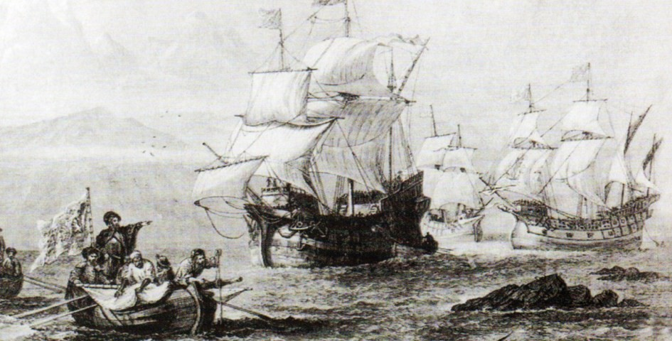
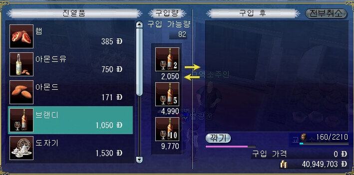
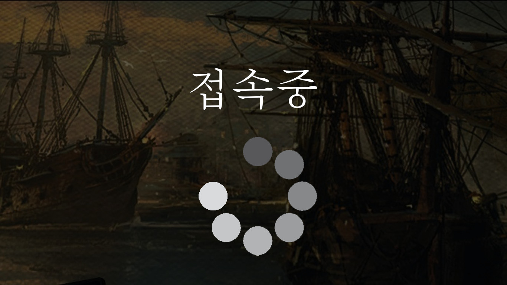
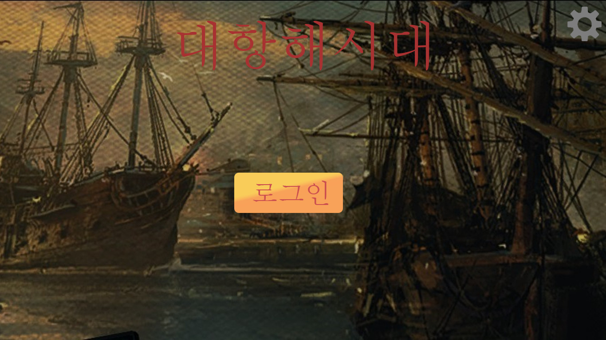
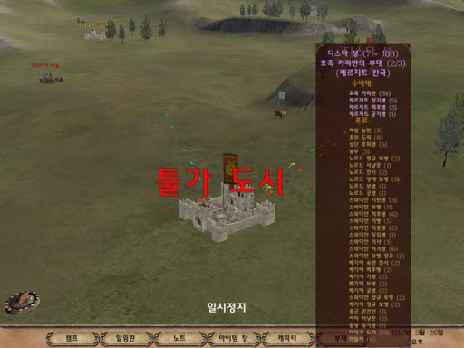

# Age Of Voyage

## 0. 목차
#### 1) [컨셉](#1)
#### 2) [관련 이미지와 동영상](#2)
#### 3) [대표이미지 그리고 컨셉과 대표이미지 기반 작품 묘사](#3)
#### 4) [Age Of Voyage 구성요소](#4)
#### 5) [게임 시스템 디자인](#5)
#### 6) [요구사항](#6)
#### 7) [키보드 이벤트에 대한 흐름도](#7)
#### 8) [용어 정리](#8)
#### 9) [주별 개발작업 계획표](#9)
#### 10) [주별 작업결과 목록](Results/index.md)
    
## 1. 컨셉<a name='1'></a>
#### 1) 메인 컨셉 :: 대항해시대
- 15~18세기중반까지 이루어졌던 항로를 개척하고 탐험과 무역을 하던 시기.
- 대항해시대를 메인컨셉으로 잡아 게임을 제작을 할 것.

#### 2) 서브컨셉1 :: 모험
- 대항해시대의 특성상 항로를 개척하기위해 바다와 여러 대륙들과 섬들을 탐험했었음.
- 그렇기에 이 게임에서도 바다, 대륙 그리고 섬을 탐험하고 모험하는 기능을 추가할 것.

#### 3) 서브컨셉2 :: 거래
- 또한 대항해시대때는 **무역** 또한 많이 진행됬었음.
- 그것을 토대로, 플레이어가 무역을 하고 AI도 무역을 하며 거래를 할때마다 **시세차익**도 발생하게 할 것.

#### 4) 서브컨셉3 :: 위험
- 대항해시대는 그야말로 **기회의 시대**였음. 허나, 반대로 언제든지 죽음이 뒤따르는 위험한 시대이기도 했었음.
- 탐험의 위험, 항해의 위험 등을 넣어 플레이어가 게임을 긴장하며 플레이할 수 있도록 여러 위험요소를 추가.
- 해적, 폭풍, 섬의 원주민들 등등..

#### 5) 서브컨셉4 :: 다중 플랫폼
- 다중 플랫폼을 지원하게 함으로써 언제든지 PC와 모바일에서도 접근할 수 있게끔 다중 플랫폼을 노려 제작.
- 그러기 위해서는 우선 **조작의 편의성**을 추구해야하며 매우 어려운 조작 난이도는 회피.
- 또한, 그래픽 수준도 PC와 모바일에서도 원활하게 돌아가게하기위해 조금 수준이 낮은 그래픽으로 제작할 것.

## 2. 관련 이미지와 동영상<a name='2'></a>

#### 1) 관련 이미지
- 
- 
- 

#### 2) 관련 동영상
- [](https://youtu.be/lzOU-CRhDSw) 

## 3. 대표 이미지 그리고 컨셉과 대표이미지 기반 작품 묘사<a name='3'></a>
#### 1) 접속 화면
- 

#### 2) 시작 화면
- 

#### 3) 게임 화면
- 

## 4. Age Of Voyage 구성요소<a name='4'></a>

## 5. 게임 시스템 디자인<a name='5'></a>

## 6. 요구사항<a name='6'></a>

#### 1) 접속화면
- socket.io 서버로 접속을 시도합니다. 접속실패시 **접속실패 메시지**를 생성합니다.
- 반대로, 접속성공시 시작화면으로 이동합니다.
- 화면 중앙에는 로딩 GIF 이미지가 배치되며, 재생되고 있습니다.

#### 2) 시작화면
- 배경은 바다에 여러 선박들이 돌아다니는 장면, 선박이 항구에 정박을 하는 장면 등 여러 장면들이 Fadein과 Fadeout을 반복하며 차례 차례 보입니다. 장면들은 약간 흐릿하게 보입니다.
- 그 앞에 크고 화려한 글꼴과 스타일로 **대항해시대**라 적힌 텍스트가 화면 상단 중앙에 배치되어 있습니다.
- 또한 화면 중앙에는 **로그인**이라 적힌 버튼이 배치되어 있습니다. 이 버튼을 누를시, **로그인메시지**가 생성됩니다.
- 마지막으로 화면 우측 상단에는 톱니바퀴 그림 아이콘이 그려져 있는 **설정** 버튼이 있습니다. 이 버튼을 누를시, **설정메시지**가 생성됩니다.
- PC에서는 **ESC**, 모바일에서는 **뒤로가기 버튼을 2번** 누르면 **게임이 종료** 됩니다.

#### 3) 월드뷰 화면
- 세계맵이 보이며, 그 세계맵을 돌아다니는 NPC/PC 파티가 보입니다.
- 화면 하단에는 **캐릭터 스탯 / 함대 정보 / 화물칸 / 퀘스트** 버튼이 가로 정렬되어 보입니다.
- 또한 화면 좌측 상단에는 일시정지 버튼이 보입니다.
- ```마우스 좌클릭(PC) / 좌측 하단에 있는 이동 원형 패드를 터치 후 드래그(모바일)``` 하면 ```클릭한 부분 (PC) / 패드 드래그 방향(모바일)```으로 캐릭터 파티가 이동합니다.
- ```키보드 1~0(PC) / 우측 하단에 있는 버튼들을 눌러(모바일)``` 요격모드, 백병전모드, 항해모드로 전환할 수 있습니다.
- 요격 모드시에는 타겟을 지정하면 해당 타겟이 사정거리 안에 들어오면 함포를 발사합니다. 이때, 선박의 측면이 타겟을 바라보고 있어야 합니다. 일제사격을 이용하여 직접 발사를 명령할 수 있습니다.
- 백병전 모드시에는 타겟을 지정하면 해당 타겟이 근접하면 선원들이 백병전을 일으킵니다.
- 항해 모드시에는 돛을 펼쳐 빠르게 이동할 수 있습니다.
- 항구에 가까이 접근하면 항구에 정박하며, **항구메시지**가 생성됩니다.
- 해안에 가까이 접근하면 해안에 정박하며, **탐험메시지**가 생성됩니다.

## 7. 키보드 이벤트에 대한 흐름도<a name='7'></a>

## 8. 용어 정리<a name='8'></a>

## 9. 주별 개발작업 계획표<a name='9'></a>
